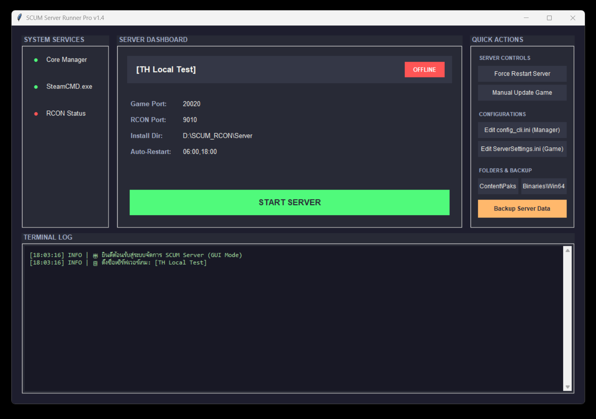

# SCUM Server Manager

A Python-based GUI application for managing SCUM dedicated servers on Windows. Features automatic SteamCMD updates, RCON monitoring, Discord notifications, and easy configuration management.

## Features

- **One-Click Start/Stop** — Start or stop the SCUM server with a single click
- **Auto Update** — Automatically checks and updates the game via SteamCMD before starting
- **RCON Monitoring** — Real-time RCON connection status and server health checks
- **Discord Notifications** — Get notified when the server goes online or offline
- **Auto Restart** — Schedule automatic server restarts at specified times
- **Config Management** — Edit server configuration files directly from the GUI
- **Backup System** — Backup mods, configs, and save files with one click
- **SteamCMD Integration** — Built-in SteamCMD for automatic game updates

## Prerequisites

- **Windows 10/11** (64-bit)
- **Administrator privileges required** — Right-click and select "Run as administrator"
- Python 3.12+ (if running from source)

## Quick Start

### Option 1: Using the Pre-built EXE (Recommended)

1. **Download** `SCUMServerManager.exe` from the `dist/` folder
2. **Right-click** the executable and select **"Run as administrator"**
3. The application will start and display the management dashboard

### Option 2: Running from Source

```bash
# Install dependencies
pip install pyinstaller requests

# Run the application (as administrator)
python runServerV3.py
```

## Screenshots

### Main Dashboard



## Configuration

### config_cli.ini

The application automatically creates `config_cli.ini` on first run. You can edit it manually or use the built-in config editor:

```ini
[SETTINGS]
installpath = Server
gameport = 20020
restarttimes = 06:00,18:00
args = -log -fileopenlog -nobattleye
discordwebhook =

[rcon]
host = 127.0.0.1
port = 9010
password =
```

### Key Settings

| Setting | Description | Default |
|---------|-------------|---------|
| `installpath` | Path to the SCUM server installation | `./Server` |
| `gameport` | UDP game port | `20020` |
| `restarttimes` | Comma-separated restart times (HH:MM) | `06:00,18:00` |
| `args` | Server launch arguments | `-log -fileopenlog -nobattleye` |
| `discordwebhook` | Discord webhook URL for notifications | *(empty)* |
| `rcon.host` | RCON host address | `127.0.0.1` |
| `rcon.port` | RCON port | `9010` |
| `rcon.password` | RCON password | *(empty)* |

## Folder Structure

```
RunServerSCUM/
├── SCUMServerManager.exe   # Pre-built executable
├── runServerV3.py          # Python source code
├── rcon.exe                # RCON utility
├── steamcmd/               # SteamCMD directory
│   └── steamcmd.exe
├── Server/                 # SCUM server installation (auto-created)
├── config_cli.ini          # Application configuration (auto-created)
├── backup_*/               # Backup directories (auto-created)
└── README.md               # This file
```

## Building from Source

To build your own executable:

```bash
pip install pyinstaller
pyinstaller --onefile --windowed --name "SCUMServerManager" runServerV3.py
```

The compiled executable will be in the `dist/` folder.

## Troubleshooting

- **"Administrator privileges required"** — Right-click the executable and select "Run as administrator"
- **Server won't start** — Check that `Server/SCUM/Binaries/Win64/SCUMServer.exe` exists
- **SteamCMD fails** — Ensure you have an active internet connection; SteamCMD runs as anonymous
- **RCON not connecting** — Verify the RCON password matches the server's `ServerSettings.ini`
- **Port conflicts** — Change `gameport` in `config_cli.ini` if port 20020 is in use

## License

This project is provided as-is for personal SCUM server management.
